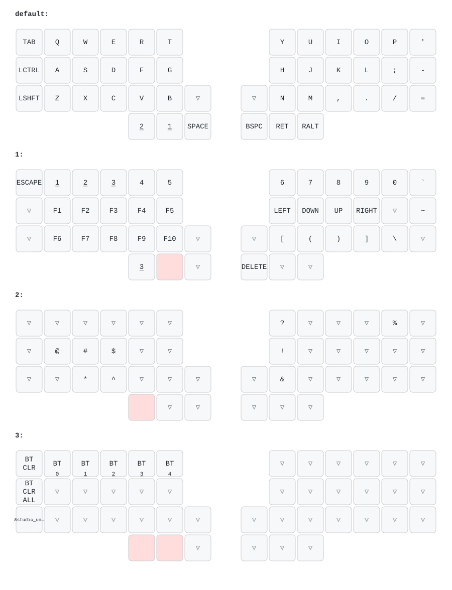

  

# zmk-config-nickey44a

分割40%ワイヤレス自作キーボード **「Nickey44A」** のZMK Firmware設定リポジトリです。

## Nickey44Aについて

- 44キーのオーソリニア配列を採用した左右分割キーボード
- Bluetooth対応の完全ワイヤレス設計
- Choc v2スイッチ対応のロープロファイル設計
- 単4電池で動作
- ボトムからトッププレートまで6.5mmの薄型設計
- 電池、キースイッチキャップ込で222gの軽量仕上げ

BOOTHでは、キット版と完成品を取り扱っています。

- [Nickey44A キット版](https://potamega.booth.pm/items/8744351)
- [Nickey44A 完成品](https://potamega.booth.pm/items/8744204)

セットアップ、ファームウェアの書き込み、Bluetoothペアリングなどの詳しい手順は、[Nickey44A ビルドガイド](https://nixiy.github.io/nickey-docs/nickey44a/)を参照してください。

---

## 現在のキーマップ

---

## ⌨️ キーマップの変更方法 (Keymap Editor)

Web GUIツール **[Keymap Editor](https://nickcoutsos.github.io/keymap-editor/)** を使うと、コードを直接編集せずにブラウザ上でキーマップを変更できます。

1. 本リポジトリを自身のGitHubアカウントに Fork します。
2. [Keymap Editor](https://nickcoutsos.github.io/keymap-editor/)でForkしたリポジトリを選択し、キーマップを編集して保存します。
3. Commit / Push 後、GitHub Actions がファームウェアを自動ビルドします。

Forkの初回設定や詳しい編集手順は、[キーマップの変更方法](https://nixiy.github.io/nickey-docs/guides/keymap/)を参照してください。

> 💡 **コードを直接編集する場合:**  
> リポジトリ内の `config/nickey44a.keymap` を直接編集して Commit / Push することでも変更可能です。

---

## 🛠️ ファームウェアのビルドと書き込み方法 (Flashing)

Keymap Editorでの変更をCommit（または `main` ブランチへPush）すると、GitHub Actions がファームウェアを自動ビルドします。完了後、Actions の最新ワークフローから `firmware` をダウンロードしてください。

書き込みの詳しい手順は、[Firmwareの書き込み方法](https://nixiy.github.io/nickey-docs/guides/firmware/)を参照してください。左右のペアリングや設定リセットについては、[Nickey44A ビルドガイド](https://nixiy.github.io/nickey-docs/nickey44a/)を確認してください。

---

## 📄 ライセンス

This repository is licensed under the MIT License - see the [LICENSE](LICENSE) file for details.

### 第三者ライセンス

Nickey44A の昇圧回路は、cormoran 氏が [DYA Dash の回路設計解説](https://note.com/cormoran/n/n1e45fe7471d8) で紹介している、各種保護機能付き昇圧回路を参考にしています。DYA Dash の回路図（`*.kicad_sch`）は MIT License で提供されています。

- Copyright (c) 2025 cormoran
- ライセンス全文: [THIRD_PARTY_NOTICES.md](THIRD_PARTY_NOTICES.md)

## PAW3222 センサー対応ブランチ（右手側）

`codex/paw3222-right-2wire` は、右手側の XIAO nRF52840 に
[14mmマウスセンサーモジュール](https://github.com/sekigon-gonnoc/small-mouse-sensor-module)
を接続するための設定です。CSをGNDへ固定した2線通信を使います。

| モジュール | 接続先 |
| --- | --- |
| 3.3V | 安定した3.3V電源 |
| CS | GND |
| MOTION | 右XIAOのP0.10 |
| SDIO | 右XIAOのP1.10 |
| SCLK | 右XIAOのP0.09 |
| GND | XIAOと共通のGND |

ピン番号はnRF52840のポート番号です。XIAOのD番号とは異なります。
P0.09/P0.10はNFC兼用パッドのため、右側のデバイスツリーで
`nfct-pins-as-gpios` を有効にしています。NFCアンテナは接続しません。
NFCピン設定が初回起動時に反映される際、MCUが自動リセットする場合があります。

### ビルドと書き込み

1. GitHub Actionsでこのブランチの **build.yml** 実行が成功したことを確認します。
2. その実行の `firmware` artifactをダウンロードして展開します。
3. 右側XIAOをリセットボタンのダブルクリックでブートローダーに入り、
   `nickey44a_r.uf2` をUSBドライブへコピーします。
4. 左側も同じビルドの `nickey44a_l.uf2` を使用できます。
5. 通常起動後、ボールを動かしてUSB/Bluetoothのカーソル移動を確認します。

`firmware/v1.*` に保存された既存UF2はセンサー未対応です。
通常、`settings_reset.uf2` の書き込みやペアリングの削除は不要です。
既存のキー配列・Studio設定は変更しません。クリックやスクロールへの
キー割り当ては追加していないため、必要に応じて別途設定してください。

### 感度・向き

初期感度は1216 CPIです。`boards/shields/nickey44a/nickey44a_r.overlay`
の `res-cpi` を608〜4826の範囲・38刻みで変更し再ビルドできます。
向きはセンサーの取り付けに依存します。逆方向ならZMKの
`trackball_listener` に座標変換のinput processorを設定してください。

### 実装と確認範囲

メーカーのArduinoサンプルの通信波形と初期化処理を基にした
ローカルドライバーを使います。SDIOは読み出し中に入力へ切り替え、
CS制御用の追加配線を必要としません。MOTION割り込みで起動し、
移動中は8ms間隔で読み出します。センサーの省電力モードを有効にしています。
深いスリープからはキーボードのキーで復帰してください。

ビルド成功は実機動作の保証ではありません。実機では電源、移動方向、
低速・高速の追従、再起動後の動作、Bluetooth接続、スリープ復帰を確認してください。
反応がなければ3.3V/GND、P1.10とD10の取り違え、FPCのピン順を確認し、
センサーを含めて電源を入れ直してください。

通信ロジックのテストは `python3 tests/test_paw3222_transport.py` で実行できます。
Python 3とCコンパイラーが必要です。実ドライバーの通信関数をGPIOの模擬実装で
実行し、65,536通りの読み書きでビット順・16クロック・SDIO方向・IRQロックを確認します。
